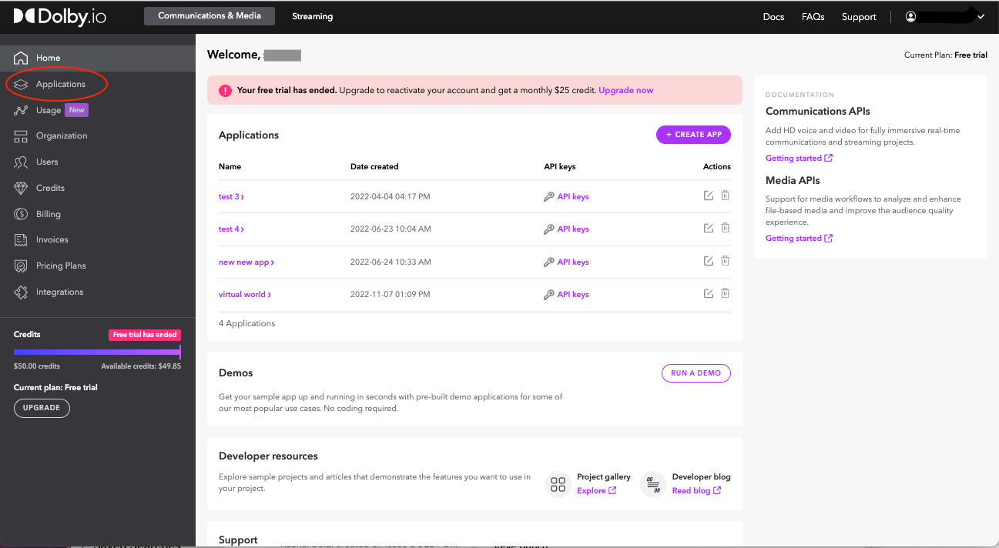

# Dolby.io Events React App

## Overview

[Placeholder, needs a copy edit from Jessica]

This project demonstrates what an events experience is like, built using React.

[Placeholder, will be replaced by screenshot from Gallery]

| Intended use   | Features                                | Tech stack            |
| -------------- | --------------------------------------- | --------------------- |
| Events         | create, start, stream and stop an event | Typescript/Javascript |
| Webinars       | A/V controls for hosts and viewers      | HTML/CSS              |
| Virtual events | Mute camera and microphone              | React                 |
|                | Screen share                            |                       |
|                | Invite co-hosts and viewers             |                       |
|                | Event Recording                         |                       |
|                | Participant List                        |                       |

## Getting Started

The following steps will quickly get you started testing the Dolby.io Communications APIs capabilities.

### Pre-requisites

To get started building this app you will need a Dolby.io account. You will also need the following -

- NPM v8.11
- Yarn v 1.22.19
- Node v18.0.0

### Basic terminology

As you browse through the source code and documents, you might come across some of these terms

- **A host** is a participant with additional permissions to manage the conference and other participants.
- **A viewer** is a participant who can only receive video and audio stream from the conference.
- **A mixer app** is a web app based on the Dolby.io communications APIs that composes multiple streams of videos into a single stream and passes that on to any RTMP or webRTC based consumer. You can customise the participant layout positions using the Mixer config file. Refer to this [blog](https://dolby.io/blog/creating-a-custom-mixer-layout-for-streaming-a-conference/) for more details.
- A **proxy-app-server** is an intermediary API server that communicates with the Dolby.io Communications Platform in order to provide functionality such as RTS/RTMP/HLS streaming or consuming web-hook data. You can see our sample implementation [here](./proxy).

### How to get a Dolby.io account

To setup your Dolby.io account, go to the [Dolby.io dashboard](https://dashboard.dolby.io) and complete the form. After confirming your email address, you will be logged in.

#### Setting up your [dolby.io](https://dashboard.dolby.io) app

You will need to generate a key and secret pair to run this app. Follow the steps to obtain a token.

1. Go to the _Dashboard_, and click `add new app` if you do not have an existing app. 
2. To enable events streaming, your app should be opted into the open beta program. You can find this at the bottom of the `Communications APIs` sidebar navigation when you click on your app. 

## How to run the Events app

Run the following steps after cloning the repository to run the application locally.

### Install dependencies

**note** : This guide is written with [Yarn](https://yarnpkg.com/) in mind.

Open a terminal window in the root directory of your project folder. Install the project's dependencies using the following command.

```bash
yarn
```

### Proxy Server code

Please follow the guide in the [api-proxy read me](./api-proxy/README.md) to get your proxy server up and running. This is required for the events app to function.

#### Start the app

Execute the following command to run the application locally in a terminal window inside this directory

> You will need a second terminal instance along with the one that runs your web proxy code.

```bash
yarn dev
```

#### Open the app in a browser

After the appropriate message appears in the terminal window, open <http://localhost:3000> in the browser. The application will launch at this address.

> If the app isn't loading, make sure you've started the proxy server

> If you want to start your proxy server on a port other than :4000, you can make a .env file and set the proxy server location using the `VITE_API_PROXY_URL` variable.

## Known issues and limitations

For a list of all known issues, checkout the Issues tab above.

## Requirements and supported platforms

Video Conference Call App supports four main browsers

- Chrome 100+
- Edge 100+

## More resources

Looking for more sample apps and projects? Head to the [Project Gallery](https://docs.dolby.io/communications-apis/page/gallery).
